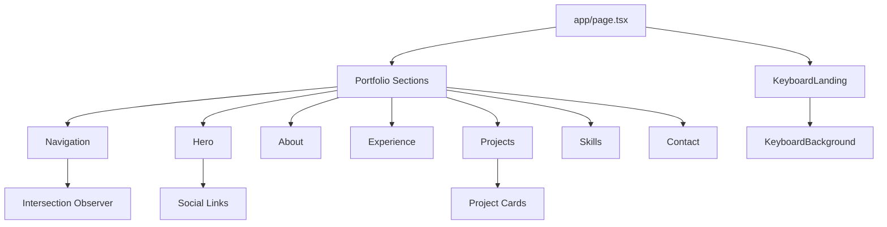
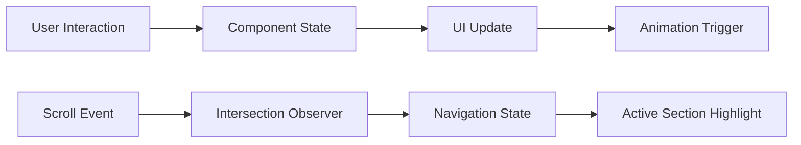
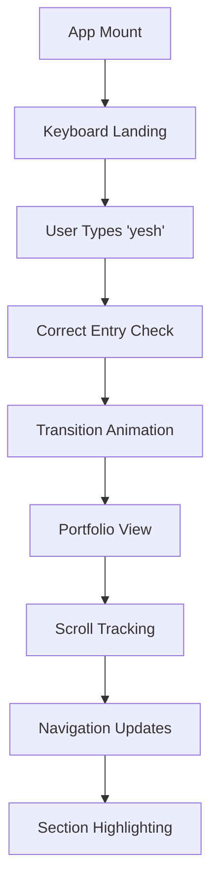
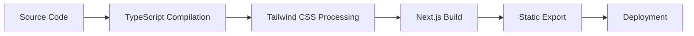

# Portfolio Architecture Documentation

## Project Overview

This is a modern, interactive portfolio website built for Yeswanth Madasu, featuring a unique keyboard-based landing experience and a comprehensive showcase of skills, projects, and professional information.

### Key Features
- **Interactive Keyboard Landing**: Custom keyboard interface with typing animation and hints
- **Smooth Transitions**: Seamless animations between landing and portfolio views
- **Responsive Design**: Mobile-first approach with adaptive layouts
- **Dark Theme**: Consistent dark mode styling throughout
- **Scroll-based Navigation**: Smooth scrolling with active section highlighting
- **Performance Optimized**: Built with Next.js 14 for optimal performance

## Technology Stack

### Frontend Framework
- **Next.js 14.2.16**: React framework with App Router
- **React 18**: Component-based UI library
- **TypeScript**: Type-safe JavaScript development

### Styling & UI
- **Tailwind CSS 4.1.9**: Utility-first CSS framework
- **Radix UI**: Accessible component primitives
- **Lucide React**: Icon library
- **Custom CSS Variables**: Theme system with light/dark mode support
- **Framer Motion 12.23.22**: Animation library

### Development Tools
- **ESLint**: Code linting (disabled during builds for flexibility)
- **PostCSS**: CSS processing
- **Geist Font**: Modern typography (Sans & Mono variants)

### Analytics & Monitoring
- **Vercel Analytics**: Performance and usage tracking

## Project Structure

```
minimal-portfolio/
├── app/                          # Next.js App Router
│   ├── globals.css              # Global styles and theme variables
│   ├── layout.tsx               # Root layout with fonts and analytics
│   ├── page.tsx                 # Main page with state management
│   └── contact/                 # Contact page route
├── components/                   # React components
│   ├── ui/                      # Reusable UI components (Radix-based)
│   ├── about.tsx               # About section component
│   ├── contact.tsx             # Contact form component
│   ├── experience.tsx          # Experience timeline
│   ├── hero.tsx                # Hero section with social links
│   ├── contact.tsx             # Contact form component
│   ├── keyboard-background.tsx  # Background keyboard animation
│   ├── keyboard-landing.tsx     # Interactive landing keyboard
│   ├── navigation.tsx          # Sidebar navigation with scroll tracking
│   ├── projects.tsx            # Project showcase grid
│   ├── skills.tsx              # Skills display
│   └── theme-provider.tsx      # Theme context provider
├── hooks/                       # Custom React hooks
│   ├── use-mobile.ts           # Mobile breakpoint detection
│   └── use-toast.ts            # Toast notification system
├── lib/                         # Utility libraries
│   └── utils.ts                # Utility functions (cn helper)
├── public/                      # Static assets
│   ├── placeholder-*.{jpg,png,svg} # Image placeholders
│   └── resume.pdf              # Resume file
├── docs/                        # Documentation
│   ├── architecture.md         # This file
│   └── keyboard.md             # Keyboard component documentation
└── styles/                      # Additional styles
    └── globals.css             # Legacy global styles
```

## Architecture Patterns

### 1. Component Architecture

#### **Atomic Design Principles**
- **Atoms**: UI components (`components/ui/`)
- **Molecules**: Composite components (navigation, cards)
- **Organisms**: Section components (hero, about, projects)
- **Templates**: Layout components (`app/layout.tsx`)
- **Pages**: Route components (`app/page.tsx`)

#### **Component Composition**


### 2. State Management

#### **Local State Pattern**
- Each component manages its own state using React hooks
- Intersection Observer for scroll-based navigation
- Keyboard interaction state in landing component

#### **State Flow**


### 3. Animation System

#### **CSS-based Animations**
- Custom keyframes in `globals.css`
- Tailwind animation utilities
- Intersection Observer triggers

#### **Animation Hierarchy**
1. **Page Transitions**: Fade in/out between landing and portfolio
2. **Section Animations**: Scroll-triggered fade-in-up effects
3. **Component Animations**: Hover states, button interactions
4. **Keyboard Animations**: Key press feedback, highlighting sequences

### 4. Responsive Design Strategy

#### **Mobile-First Approach**
- Base styles for mobile devices
- Progressive enhancement for larger screens
- Custom hook for mobile detection (`use-mobile.ts`)

#### **Breakpoint System**
- **Mobile**: < 768px
- **Tablet**: 768px - 1024px
- **Desktop**: > 1024px

## Data Flow Architecture

### 1. Application State Flow



### 2. Component Communication

#### **Props Down, Events Up**
- Parent components pass data down via props
- Child components communicate up via callbacks
- No global state management needed due to simple data flow

#### **Event Handling Pattern**
```typescript
// Parent Component
const handleCorrectEntry = () => {
  setIsTransitioning(true)
  setShowPortfolio(true)
}

// Child Component
<KeyboardLanding onCorrectEntry={handleCorrectEntry} />
```

## Performance Optimizations

### 1. Code Splitting
- Next.js automatic code splitting
- Dynamic imports for heavy components
- Route-based splitting with App Router

### 2. Image Optimization
- Next.js Image component (disabled for static export)
- Placeholder images for development
- Optimized asset delivery

### 3. Animation Performance
- CSS transforms for smooth animations
- `will-change` properties for GPU acceleration
- Intersection Observer for efficient scroll tracking

### 4. Bundle Optimization
- Tree shaking with ES modules
- Selective Radix UI component imports
- Minimal external dependencies

## Security Considerations

### 1. Content Security
- No user-generated content
- Static asset serving
- Secure external links with `rel="noopener noreferrer"`

### 2. Privacy
- Vercel Analytics for anonymous usage tracking
- No personal data collection
- GDPR-compliant analytics

## Deployment Architecture

### 1. Build Process


### 2. Hosting Strategy
- **Static Site Generation (SSG)**: Pre-rendered at build time
- **CDN Distribution**: Fast global content delivery
- **Edge Optimization**: Vercel Edge Network

### 3. CI/CD Pipeline
- Automated builds on git push
- Preview deployments for branches
- Production deployment from main branch

## Accessibility Features

### 1. Keyboard Navigation
- Full keyboard accessibility
- Focus management
- ARIA labels and roles

### 2. Screen Reader Support
- Semantic HTML structure
- Alternative text for images
- Proper heading hierarchy

### 3. Visual Accessibility
- High contrast color scheme
- Scalable typography
- Responsive design for various devices

## Browser Compatibility

### Supported Browsers
- **Modern Browsers**: Chrome 90+, Firefox 88+, Safari 14+, Edge 90+
- **Mobile Browsers**: iOS Safari 14+, Chrome Mobile 90+
- **Features Used**: ES2020, CSS Grid, Flexbox, Intersection Observer

### Fallbacks
- Graceful degradation for older browsers
- CSS feature queries for advanced animations
- Progressive enhancement approach

## Development Workflow

### 1. Local Development
```bash
pnpm dev          # Start development server
pnpm build        # Production build
pnpm lint         # Code linting
pnpm start        # Start production server
```

### 2. Code Organization
- **Feature-based structure**: Components grouped by functionality
- **Consistent naming**: kebab-case for files, PascalCase for components
- **Type safety**: TypeScript throughout the codebase

### 3. Styling Conventions
- **Utility-first**: Tailwind CSS classes
- **Component variants**: Class Variance Authority (CVA)
- **Theme consistency**: CSS custom properties

## Future Enhancements

### Planned Features
1. **Content Management**: Dynamic content updates
2. **Internationalization**: Multi-language support
3. **Advanced Animations**: More sophisticated transitions
4. **Performance Monitoring**: Real-time performance tracking
5. **SEO Optimization**: Enhanced meta tags and structured data

### Technical Debt
1. **Component Testing**: Add comprehensive test suite
2. **Error Boundaries**: Implement error handling
3. **Performance Monitoring**: Add Core Web Vitals tracking
4. **Accessibility Audit**: Comprehensive a11y testing

## Troubleshooting Guide

### Common Issues

#### 1. Animation Performance
- **Symptom**: Choppy animations on mobile
- **Solution**: Reduce animation complexity, use `transform` over layout properties

#### 2. Keyboard Detection
- **Symptom**: Keyboard events not registering
- **Solution**: Check event listener attachment and key mapping

#### 3. Scroll Tracking
- **Symptom**: Navigation not highlighting correctly
- **Solution**: Verify Intersection Observer thresholds and section IDs

### Debug Tools
- React Developer Tools
- Chrome DevTools Performance tab
- Lighthouse audits for performance

---

## Maintenance Notes

This documentation is automatically maintained through Cursor rules. When making architectural changes, ensure the following sections are updated:

- **Component relationships** when adding/removing components
- **Data flow diagrams** when changing state management
- **Technology stack** when updating dependencies
- **Performance considerations** when adding new features

Last Updated: [Automatically maintained by Cursor rules]
